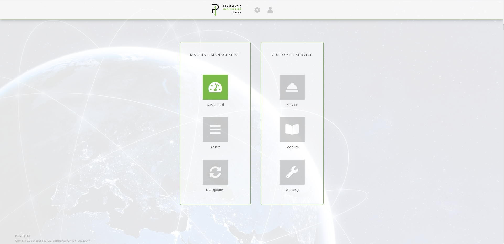

.. omap documentation master file, created by
   sphinx-quickstart on Sun Dec 26 21:04:10 2021.
   You can adapt this file completely to your liking, but it should at least
   contain the root `toctree` directive.

Welcome to the Open MAchine Platform OMAP
=========================================

Welcome to the *Open MAchine Platform (OMAP*)!
The aim of *OMAP* is to make adoption of *industry 4.0* or *digitalization* easy to use and adoptable for companies of all sizes and of all roles.

Speaking of roles, we usually distinguish between **Machine Manufacturers**, i.e. Companies that build and sell *Machines* and **Machine Operators**, i.e. Companies that use *Machines* to produce whatever they produce.

The *OMAP* project aims especially at pushing the cooperation of all involved parties over machine data to build ecosystems that lead to a gain for all involved parties.

.. note:: This documentation is currently being actively developed and may not be complete as of yet. For any questions please open an issue on our `GitHub page <https://github.com/pragmaticindustries/open-machine-plattform>`_.

.. toctree::
   :maxdepth: 2
   :caption: Contents:

   quickstart
   architecture
   features/features
   developers
   mqtt
   faq

.. Probably add that later?
   Indices and tables
   ==================

   * :ref:`genindex`
   * :ref:`modindex`
   * :ref:`search`
